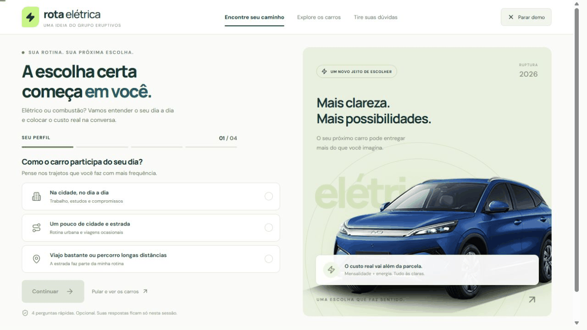
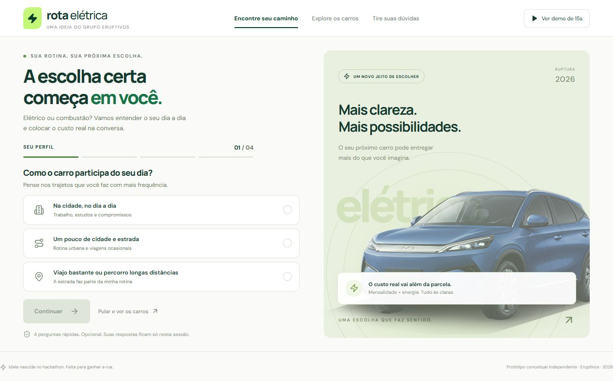
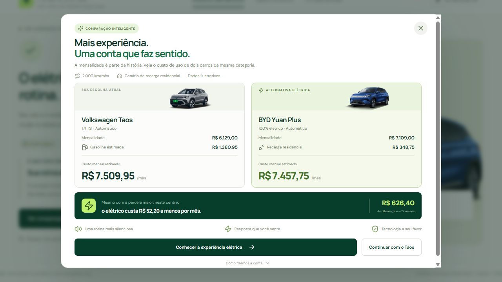
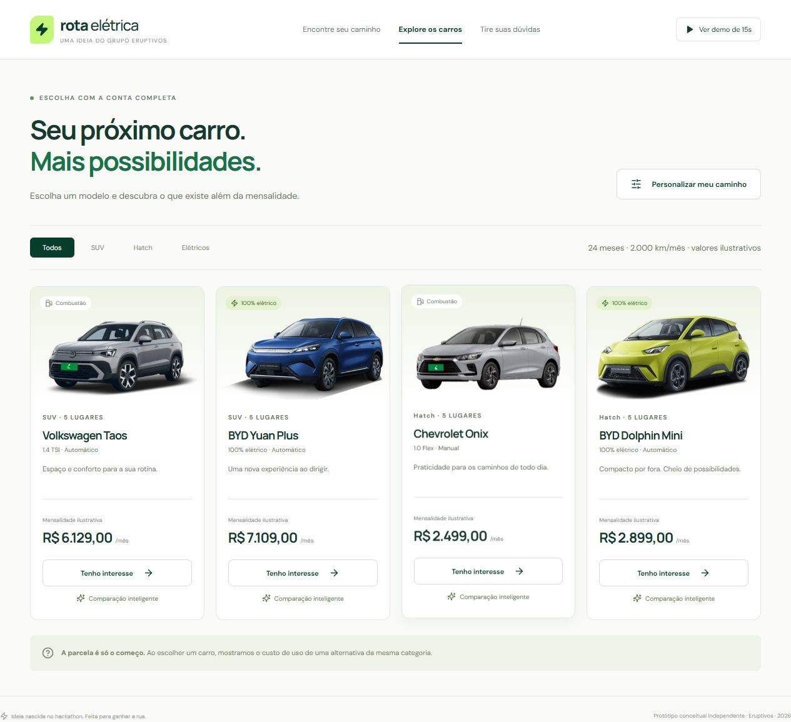

<div align="center">

<h1>⚡ Rota elétrica</h1>

<p><strong>Uma ideia dos Eruptivos para escolher um elétrico com mais clareza.</strong></p>

<p>Hackathon Ruptura 2026 · Case 1: Mobilidade elétrica · Grupo 5</p>

<p>
  <a href="#o-desafio">O desafio</a> ·
  <a href="#a-solução">A solução</a> ·
  <a href="#do-pitch-ao-protótipo">Do pitch ao protótipo</a> ·
  <a href="#os-eruptivos">O time</a>
</p>

</div>



Uma noite virada, muitas ideias e **três minutos para apresentar a solução**. Este repositório guarda o caminho que percorremos no hackathon e a continuação da ideia depois do evento.

## O desafio

Entre as palestras e os materiais da Localiza, recebemos uma pergunta: **como a assinatura pode ajudar as pessoas a superar as barreiras para adotar um carro elétrico?**

O interesse existia. A decisão de contratar ainda encontrava obstáculos.

| Dado apresentado no evento | O que ele nos fez investigar |
| --- | --- |
| **80%** dos leads de elétricos que assinaram optaram por combustão. | O que mudava entre o interesse inicial e a escolha final? |
| **59%** da base pesquisada afirmou que pensar em eletrificados aumentava sua vontade de assinar. | Como transformar essa disposição em uma decisão mais esclarecida? |

<sub>Fonte: briefing do evento, páginas 11 e 14. Os percentuais têm recortes diferentes: os 80% se referem a quem concluiu uma assinatura; os 59% vêm de uma pesquisa com aproximadamente mil leads e clientes. <a href="rota-eletrica/case/Ruptura.pdf">Consultar o material do case.</a></sub>

## Como chegamos à ideia

Chegar a um consenso deu trabalho. Discutimos público, preço, recarga, autonomia e a jornada de quem estava escolhendo um carro. Pesquisamos referências de calculadoras e experiências de adoção para entender o que poderia reduzir o esforço da decisão.

O recorte que escolhemos foi o de pessoas considerando uma assinatura, com orçamento compatível e interesse em eletrificados. Querer um carro novo e gostar da tecnologia não significava ter segurança para mudar a rotina.

Depois de várias conversas, concentramos a proposta em duas dores:

- **Percepção de valor:** a mensalidade aparecia de imediato, mas comparar combustível, energia e experiência ainda exigia pesquisa e contas do cliente.
- **Incerteza:** dúvidas sobre onde carregar, como viajar e o que mudaria no dia a dia podiam permanecer abertas no momento da escolha.

Nossa hipótese era que mostrar a conta com premissas claras e responder às dúvidas da rotina poderia ajudar nessa decisão. Uma calculadora sozinha não resolveria tudo.

## A solução

**Rota elétrica** conecta uma comparação de custo mensal a uma orientação simples sobre o uso do carro.

| Entrada | Experiência proposta |
| --- | --- |
| **Questionário opcional** | Quatro perguntas sobre rotina e prioridades, seguidas de uma recomendação e dúvidas relevantes para o perfil. |
| **Escolha direta no catálogo** | Ao selecionar combustão, aparece uma alternativa elétrica da mesma categoria. Ao selecionar elétrico, a experiência explica o valor da escolha e oferece respostas sobre recarga. |

O comparativo mostra **mensalidade + gasolina ou energia**. O cliente pode seguir com o elétrico ou manter combustão. Se a recarga ainda estiver indefinida, essa pendência aparece na explicação.

<details>
<summary><strong>Ver as telas do protótipo</strong></summary>

### Questionário opcional



### Comparação inteligente



### Catálogo



</details>

## Do pitch ao protótipo

No evento, **o pitch de três minutos focou na recomendação inteligente e no reforço de valor**. Precisávamos apresentar o problema, sustentar a proposta e explicar a solução. A jornada completa, com questionário e dúvidas personalizadas, ficou além do que conseguimos mostrar naquele tempo.

Depois do hackathon, **Luiz Fernando tomou a iniciativa de organizar este repositório e desenvolver uma demonstração navegável da proposta completa**, para registrar o processo e tirar a ideia do papel.

A pesquisa, as discussões e a concepção da solução foram trabalho do grupo. Este projeto preserva essa autoria coletiva e dá continuidade ao que construímos juntos.

## Os Eruptivos

**Davi Rangel · Luiz Fernando · Edson Henrich · Felipe Pires · Gabriele Monteiro · Luan Miranda**

Grupo 5 do Hackathon Ruptura 2026.

## Pesquisa e materiais

- [Briefing do case](rota-eletrica/case/Ruptura.pdf)
- [Apresentação sobre mobilidade elétrica](rota-eletrica/case/Mobilidade%20El%C3%A9trica%20-%20Ruptura.pptx)
- [Pesquisas, perguntas e caminhos de solução](rota-eletrica/docs/pesquisa%20de%20dados/)
- [Decisões do protótipo e premissas da comparação](rota-eletrica/docs/decisoes.md)

## Experimentar e desenvolver

Para testar sem instalar, baixe [Rota-eletrica.html](rota-eletrica/Rota-eletrica.html) e abra no navegador. O botão **Ver demo de 15s** percorre o fluxo automaticamente.

<details>
<summary><strong>Rodar o código localmente</strong></summary>

Requer Node.js 20.19+ ou 22.12+ e npm.

```bash
cd rota-eletrica
npm install
npm run dev
```

**Stack:** React, TypeScript, Vite e CSS responsivo. Sem backend ou armazenamento de respostas.

```bash
npm test
npm run build
```

Mais detalhes no [README técnico](rota-eletrica/README.md).

</details>

---

<sub>Protótipo conceitual independente, sem vínculo oficial com a Localiza. Preços e consumos da demonstração são ilustrativos. A proposta ainda precisa ser testada para avaliar seu efeito na contratação. Parcerias e benefícios sugeridos na pesquisa são hipóteses, não ofertas disponíveis.</sub>
